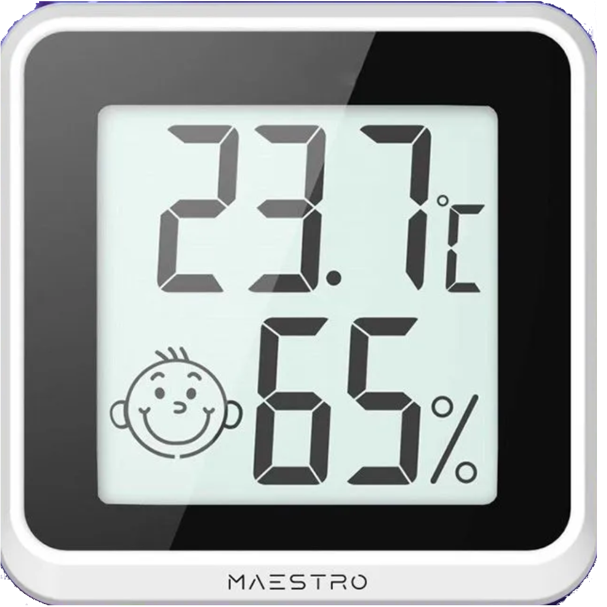

# ble-thermo-hygrometer Bluetooth клиент для комнатного термогигрометра

## Утилита ble-thermo-hygrometer

Запустите ble-thermo-hygrometer в консоли

```shell
ble-thermo-hygrometer
```

Сначала будет выведен список обнаруженных устройств- MAC адрес, имя и RSSI  

```shell
Press Ctrl+Break (or Ctrl+C) to interrupt
Discovered device ed:76:ba:be:8c:05 LT_8C05 -69dBm
...
```

По мере того, как устройство будет отправлять данные, они будут отображаться в консоли (без меток времени):

```shell
ed:76:ba:be:8c:05 LT_8C05 28.6C 10.0%
ed:76:ba:be:8c:05 LT_8C05 28.5C 10.0%
...
```

Эта программа всего лишь пример, используйте ее как пример.

## Как использовать программу в своих целях

Используйте как основу пример программы ble-thermo-hygrometer.cpp или tests/test-read.cpp

В зависимости включите библиотеку

```
libble.lib
```

Подключите заголовочные файлы

```c++
#include "ble-helper.h"
```

Создайте объект BLEHelper и с объектом - получателем данных: 
```c++
    BLEHelper b(new MyDiscoverer, nullptr);
```

Класс объекта - получателя данных будет описан ниже.

Запустите обнаружение BLE устройств и подождите примерно 20-30 секунд:

```c++
b.startDiscovery();
auto found = b.waitDiscover(1, 30);
```

или укажите ожидаемое устройство с известным MAC адресом (его нужно указать строкой):

```c++
auto found = b.waitDiscover("ed:76:ba:be:8c:05");
```

Проверьте, сколько устройств найдено:

```c++
if (found <= 0)
    ...
```    
### Класс объекта - получателя данных OnDeviceEvent

Создайте новый класс - наследник OnDeviceEvent.

Перекройте в нем методы

- discoverFirstTime()
- discoverNextTime()
- onData()

Все методы могут быть пустыми.

В методе onData параметр tempx10 передает значение температуры в десятых долях градусов.
Параметр hygrox10 передает значение влажности в десятых долях процентов (промилле).
Параметр unitCode принимает значения:

- 0 -  шкала Цельсия
- 1 -  шкала Фаренгейта

Пример:

```c++
    void onData(DiscoveredDevice &device, uint16_t tempx10, uint16_t hygrox10, uint8_t unitCode) override
    {
        std::cout << macAddress2string(device.addr) << ' ' << device.name
            << ' ' << tempx10 / 10 << '.' << tempx10 % 10 << (unitCode == 1 ? 'F' : 'C')
            << ' ' << hygrox10 / 10 << '.' << hygrox10 % 10 << '%'
            << std::endl;
    }
```

Метод stopDiscovery() останавливает обнаружение устройств.

```c++
    b.stopDiscovery(10);
```

Единственный необязательный параметр задает тайм-аут ожидания завершения выполнения метода в секундах.

## Сборка

Сборка делается CMake для Visual Studio. Можно использовать CLion с установленным 
на машине Visual Studio.  

## Ограничения

Сейчас есть только версия для Windows 11 (Windows 10) с WinRT.

WinRT требует компилятора с C++17 стандартом.

## Лицензия MIT

Смотрите лицензию в файле LICENSE.

## Тесты

Проверялась на устройстве с торговым названием Maestro.



Это устройство показывает следующие сервисы (16-bit UUID):

```
1800
180a
180f
ffe5
fe59
```

Сервис ffe5 имеет характеристики:

```
ffe8 уведомления
ffe9 запись
```

Программа подписывается на уведомления характеристики ffe8 сервиса ffe5.

Уведомление отправляет 13 байт, первые три байта - префикс (AA AA A2), последний байт - суффикс (55), которые не изменяются:

```
AA AA A2 00 06 01 0E 00 64 01 00 70 55
```

Все числа имеют порядок байт - big endian.

Байты 2 - 3 - длина полезных данных (00 06) - 6 байт.

Байты 4 - 5 - значение температуры в десятых долях градуса (01 0e).

Байты 6 - 7 - значение влажности в десятых долях процента (00 64).

Байт 8 - неясно (01).

Байт 9 - значение шкалы температуры (00). 0- Шкала Цельсия, 1- шкала Фаренгейта.

## Ссылки

- [Rémi Peyronnet. Température Bluetooth LE dans domoticz par reverse engineering et MQTT auto-discovery Home Assistant](https://www.lprp.fr/2022/07/capteur-bluetooth-le-temperature-dans-domoticz-par-reverse-engineering-et-mqtt-auto-discovery-domoticz-et-home-assistant/)
- [BLEConsole](https://github.com/sensboston/BLEConsole)

## Лицензтя

MIT License (see LICENSE file). All rights reserved.

Copyright (C) 2026 Andrei Ivanov. All rights reserved.
